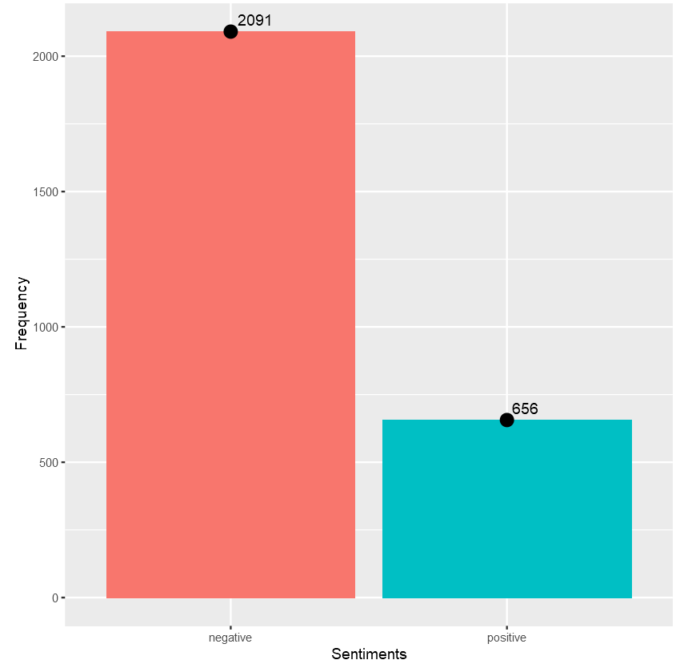

# Sentiment analysis (mini project)

Mini project proposed by the [Data Science Academy](https://www.datascienceacademy.com.br/), regarding Sentiment Analysis on Twitter using R language.

Which sentiment prevails the most on the recent comments related to the 
President Trump? Is it positive or is it negative?

Context: The acts of President Trump are polemic to some and applauded by others.
Let's see which sentiments prevail the most on the 2000 recent comments on twitter.

These are some results of this short analysis:

